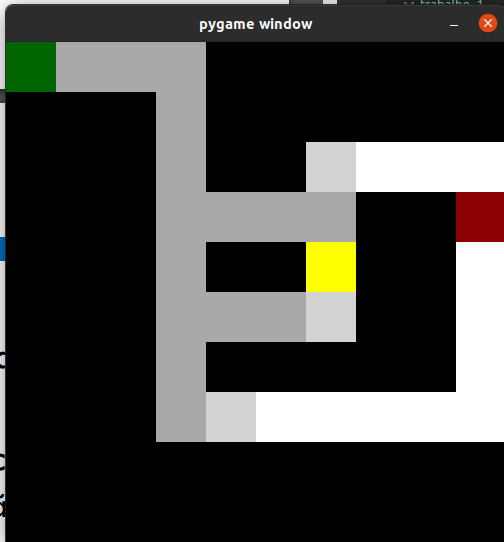

# Implementação BFS e DFS
- Esse é um projeto que visou a implementação de um código para resolver um labirinto através de:
   - Busca em Largura (BFS)
   - Busca em Profundidade (DFS)

## Pré-requisitos:
- ter python instalado
- Para rodar a interface gráfica do código, é necessário ter instalado o pygame.
- Uma das maneiras para instalá-lo no linux, é rodar no terminal:
```
sudo apt-get install python-pygame
```
- Outras formas de habilitar o pygame podem ser vistas no site:
```
https://www.pygame.org/wiki/GettingStarted
```

## Guia de Uso:
1. Para rodar o código, é necesário entrar no diretório ```trabalho_1``` e rodar um dos seguintes comandos no terminal:
```
python maze_solver.py
```
ou 
```
python3 maze_solver.py
```

2. Após rodar o código, aparecerá no terminal a seguinte frase:
```
Selecione BFS[1] ou DFS[2]
```
Para resolver o labrinto com BFS, digite 1 no terminal e precione enter e para resolver com DFS é só fazer o mesmo processo com o número 2.
3. Seguidos os passos, a interface gráfica inicilizará mostrando o caminho percorrido pelo agente:



	
## Autoria:
- Maria Luiza Fontes Dantas 
- André Luis Correa Barbado
	